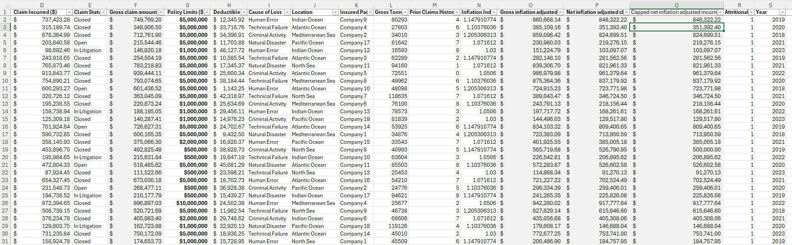
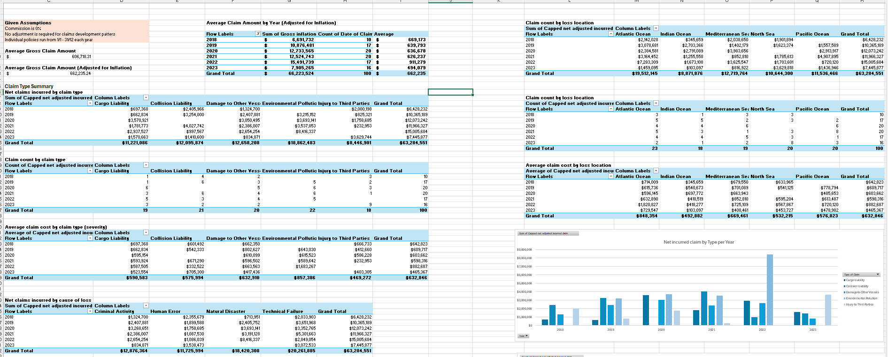
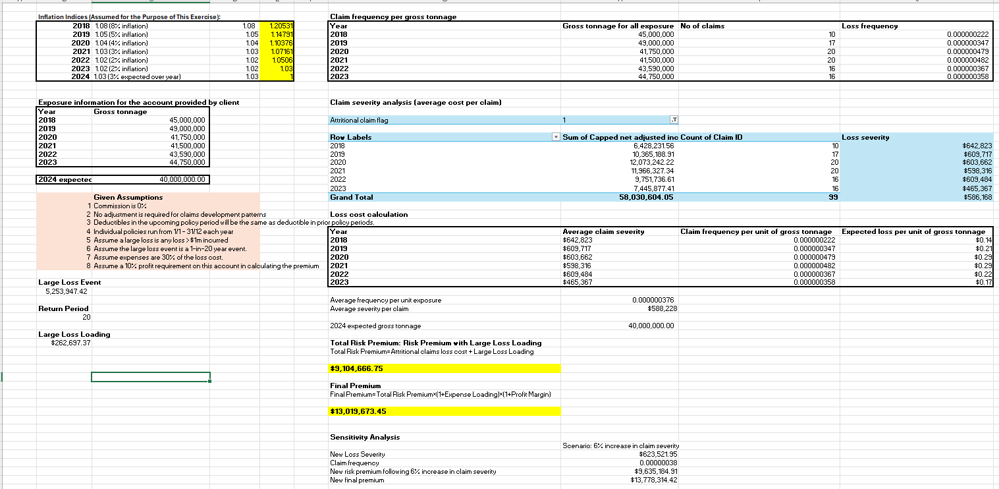

# Marine-Claims-Pricing-Analysis

## Project Overview
Actuarial analysis of Marine Liability insurance claims from 2018 to 2023 with the goal of creating an experience-based pricing recommendation for 2024.

## Analysis Description
- Analyzed and interpreted a dataset of 100 Marine Liability insurance claims.
- Analyzed claims frequency and severity trends using data visualization techniques.
- Applied actuarial principles to evaluate risks and calculated experience-based premiums.
- Developed comprehensive reports that included assumptions, methodologies, and commentary on risks and uncertainties.

### Claims Data Tab

### Exploratory Data Analysis Tab

### Pure Premium Work Tab

### Report
![Report]
